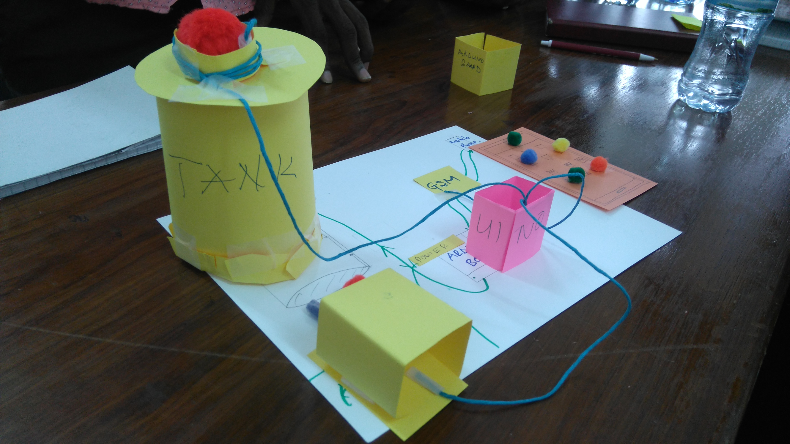
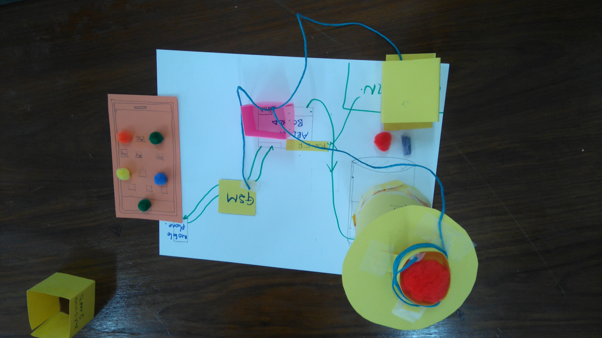

# Welcome to Eagle organization
This is orgnaization that put effort on how to preserve water in our home are reduce billing cost.
## Aqua sensor
Actualy it a electronic circuit to maintain water level in tanks whether it full, empty or it is on half awy.

If you ever have visit house of your friend or an institute, most of time there is no management of water supply and storage.

## A tank for water reservation


## Existing Problems
Water spoilage :As normal citizen how should i know if my tank is full or not to avoid pouring down of water which could be used for other 
uses.


## Solution 
We design a electroninc circuit which will detect whether water are full or not by notifing the use through mobile phone.

## This is a sketch of the circuit.


## Prototype to solution




`````

`````
